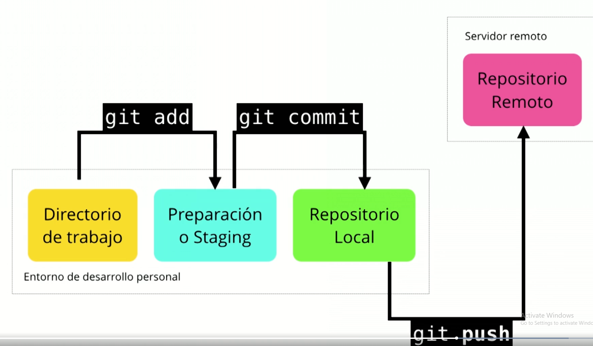
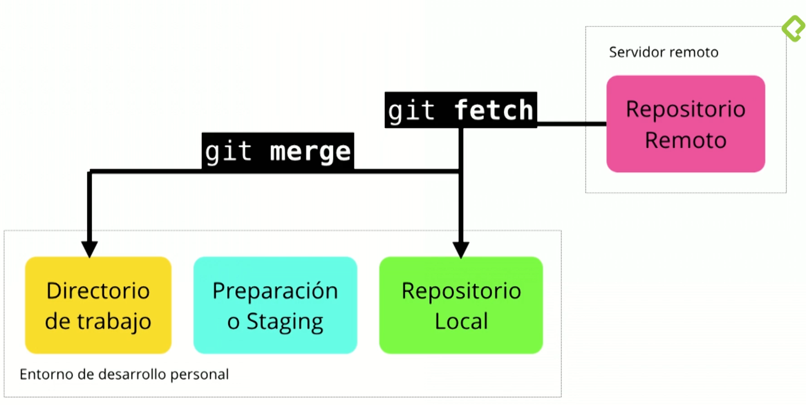
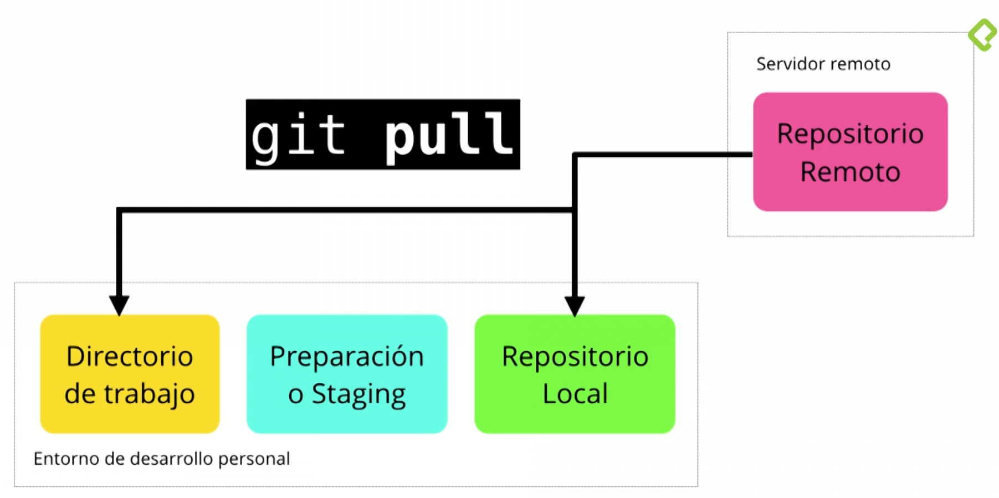

# 2) Workflow 
-Directorio de trabajo: git add (tracked)-> a staging

-Preparación o Staging : git commit -> a repo local

-Rep Local

-Rep remoto: (github, git, git bucket) git clone-> a dir de trabajo y a repo local. Git push a repo remoto.

Comandos Importantes Extracción:

### Branches
    Status de rama: git status (sin hacer git push)
    Para fucionar una rama con otra: git merge
    Moverse de rama que le apunta HEAD: git checkout _branch_
    Explicación: 
    
